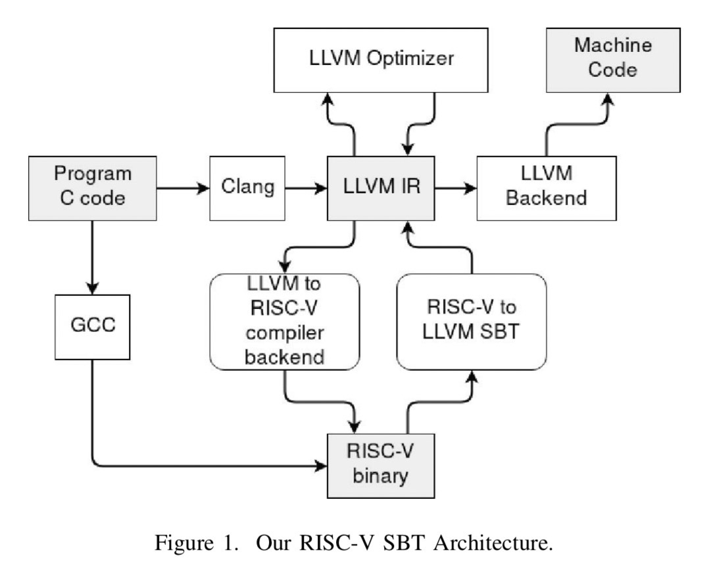
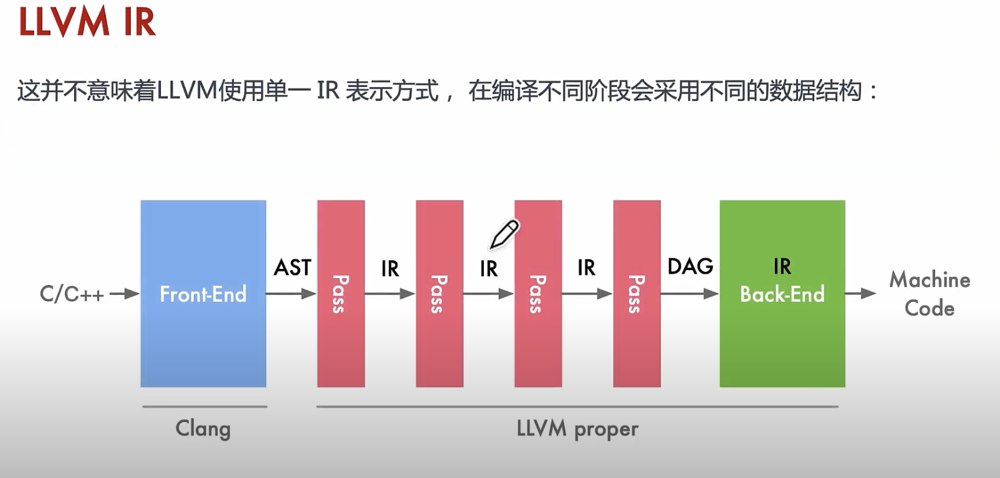
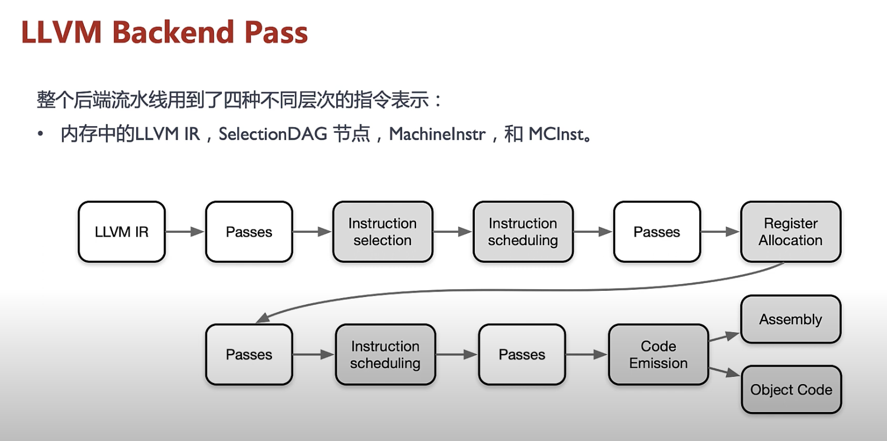

# Progress Log

**Starting Date:** 2023/09/23

## 2023/09/23 (Sat) ~ 2023/09/24 (Sun)

- **Conversation with Jersv:**
  I asked Jersv whether it is possible to focus on branch prediction on rv32emu.

  > "你看[這篇論文](https://research.manchester.ac.uk/en/publications/evaluating-the-impact-of-optimizations-for-dynamic-binary-modific?fbclid=IwAR0D1Mej_z6l6IVULspspPKKXuw2I1idvFhstq4_MIT2UDFbIladm-6wpVI)，主要講 branch optimization。這篇論文的題材比你想像中更窄，但依舊是很好的研究。--Jserv

- **Reading Notes - Evaluating the Impact of Optimizations for Dynamic Binary Modification on 64-bit RISC-V:**

  - **Question 1:** What is the question of the paper?

    - **Answer:**

      Target in the code cache exceeds ±1MB range, but the original address in the original binary did not. They discuss "jump trampolines" to remove JALR with JALs, avoiding overhead with register jumps.

      - **Subquestion:** What is register jump overhead?

        - **Answer:**

          "Register jump overhead" refers to the additional processing time or computational overhead caused by using jump instructions, like conditional jumps or branches, which requires the CPU to perform tasks like saving and restoring the program counter or updating branch prediction.

  - **Question 2:** What is Dynamic Binary Modification?

    - **Answer:** Dynamic Binary Modification (DBM) involves modifying a program's binary code during runtime.

      - **Sub-questions:**

        - When does it happen?

          - **Answer:** DBM occurs during runtime.

        - What applications can be done?

          - **Answer:** DBM includes binary instrumentation (DBI), binary translation, virtualization, and error detection.

        - Disadvantages?

          - **Answer:** DBM has performance overhead, particularly in handling position-dependent instructions.

        - Frameworks:

          - **Answer:** One of the frameworks for DBM is MAMBO.

        - "Dynamic Binary Modification" 會降低執行效率，為什麼還值得做?

          - **Answer:**

            > Jserv: 因為某些指令序列的執行成本更高

  - **Question 3:** What is the purpose of jump trampolines and how do they affect performance?

    - **Answer:**
      (NYI)

  - **Question 4:** What benchmark is used?

    - **Answer:** SPEC CPU2006

  - **Question 5:** What are the steps to perform branch optimization?

    - **Answer:** (NYI)

  - **Question 6:** What data structures are needed?

    - **Answer:** (NYI)

  - **Question 7:** RV32I 的 JAL 最遠可以跳多遠?

    - **Answer:**

      在 RISC-V 的 RV32I 指令集中，JAL（Jump and Link）指令使用的立即值（即跳躍偏移量）是 20 位，用來計算目標地址。這個 20 位的立即值代表的是跳躍目標相對於下一條指令的偏移量，以字節（byte）為單位。

      計算跳躍目標地址的方法：

      將 20 位的立即值（imm）左移 1 位（乘以 2），以變為 21 位，再將這 21 位的立即值加上下一個指令的地址（PC + 4），得到跳躍目標地址。
      所以，JAL 指令的最大偏移量就是能夠表示的最大 20 位二進制數的一半，再乘以 2，即：

      最大偏移量 = (2^19 - 1) \* 2 bytes = 524,286 bytes = 0.52 MB

      這代表 JAL 指令可以跳躍到目標地址的最遠範圍是 524,286 個字節。這個範圍是相對於當前指令位置的偏移量，並且可以向前或向後跳躍。

      [When to use J, JAL, JR, JALR?](https://www.reddit.com/r/RISCV/comments/13rcn8e/when_to_use_j_jal_jr_jalr/)

  - **ENGLISH VOCABULARIES**
    1. necessitate 使成為必需 (你ㄙㄟ捨 tate)
    2. exploit 利用;開發;發揮

### MAMBO

Download [MAMBO](https://github.com/beehive-lab/mambo)

```bash
git clone --recurse-submodules https://github.com/beehive-lab/mambo.git
cd mambo

cd pie
make all

cd ../
make
```

Run First Example:

```bash
% ./dbm /bin/ls -g
# ./dbm <path_to_executable> <args>
drwxrwxr-x 2 clarity    4096 Sep 24 15:00 api
drwxrwxr-x 4 clarity    4096 Sep 24 14:57 arch
-rw-rw-r-- 1 clarity   10887 Sep 24 14:57 common.c
-rw-rw-r-- 1 clarity    3378 Sep 24 14:57 common.h
-rwxrwxr-x 1 clarity 1254064 Sep 24 15:04 dbm
-rw-rw-r-- 1 clarity   21143 Sep 24 14:57 dbm.c
-rw-rw-r-- 1 clarity   12409 Sep 24 14:57 dbm.h
-rw-rw-r-- 1 clarity    3173 Sep 24 14:57 dispatcher.c
drwxrwxr-x 2 clarity    4096 Sep 24 15:00 elf
-rw-rw-r-- 1 clarity     440 Sep 24 14:57 kernel_sigaction.h
-rw-rw-r-- 1 clarity   11358 Sep 24 14:57 LICENSE
-rw-rw-r-- 1 clarity    3358 Sep 24 14:57 makefile
drwxrwxr-x 2 clarity    4096 Sep 24 15:04 pie
drwxrwxr-x 4 clarity    4096 Sep 24 14:57 plugins
-rw-rw-r-- 1 clarity    1226 Sep 24 14:57 plugins.h
-rw-rw-r-- 1 clarity    9892 Sep 24 14:57 README.md
-rwxrwxr-x 1 clarity    4566 Sep 24 14:57 scanner_common.h
-rw-rw-r-- 1 clarity    7419 Sep 24 14:57 scanner_public.h
-rw-rw-r-- 1 clarity   20265 Sep 24 14:57 signals.c
-rw-rw-r-- 1 clarity   16254 Sep 24 14:57 syscalls.c
-rw-rw-r-- 1 clarity    1349 Sep 24 14:57 syscalls.h
drwxrwxr-x 3 clarity    4096 Sep 24 14:57 test
-rw-rw-r-- 1 clarity   27466 Sep 24 14:57 traces.c
-rw-rw-r-- 1 clarity    1975 Sep 24 14:57 util.h
-rw-rw-r-- 1 clarity    7031 Sep 24 14:57 util.S
We re done; exiting with status: 0 #<-- by dbm
```

## 2023/09/25 (Mon.)

Jserv: 你要先了解模擬器的類型

### [Banshee: A Fast LLVM-Based RISC-V Binary Translator](https://pulp-platform.org/docs/Banshee_ICCAD_2021.pdf?fbclid=IwAR0RzIDLto_-bNwb0w8FSCVlJ32VrIUMbV5qNzvEoDkHKVg8F3j6dZqrXvg)

Github Link -- [[link]](https://github.com/pulp-platform/banshee)

- **Question 1:** 文中分三種 Simulator? 哪三種

  - **Answer:**

    1. **Cycle-accurate**

       - Verilator[7], Questa Advanced Simulator[8]
       - Very slow for large systems (tens of kIPS)

    2. **Event-based**

       - gem5[9], GVSoC[10]
       - Few MIPS, still too slow

    3. **Functional**
       - QEMU[11,12], rv8[13], R2VM[24]
       - Few GIPS, but only for a handful of cores

**None are well-suited for manycore!**

- **Question 2:** What strategy Banshee take?

  - **Answer:**

    (Banshee is a functional emulator)

    1. Static binary translation
    2. RISC-V binary &rarr; \[Binary to IR Translator\] &rarr; LLVM IR &rarr; Opt
       &rarr; \[IR to Host Translator\] &rarr;

    3. Emulation: Using host's parallism

- **Question 3:** What evaluation is done?

  - **Answer:**
    1. performance estimation
    2. Benchmark: LFSR (Compute bound)
    3. With or without ISA extensions
       - Floating-point repetition
       - (Indirect) Stream Semantic Registers (Xssr & Xissr)
    4. Scaling with manticore
    5. Scaling with MemPool
    6. Comparrison to related work
    7. Latency modeling

- **Question 4:** Single thread binary how to scale with multicore?
  - **Answer:**
    - NYI

## 2023/09/30 (Sat.)

### Reading nots:

#### **Towards a High-Performace RISC-V Emulator**

- RISC-V 目前可以用的 Emulator 不多，想要最快，所以使用 DBT (Dynamic Binary Translation) / SBT (Static Binary Translation)。

DBT 其中一種技巧叫 Region Formation Technique (RFT) - Region formation is the process of dividing the binary code into segments or blocks, referred to as regions, based on certain criteria.

- **Question 1:** What are the contributions?

  - **Answer:**
    1. Show that it is possible to perform a high-quality translation of RISC-V binaries to x86 and ARM
    2. Compare the performance of their SBT with performance of other RISC-V emulators and argue that **there is a lot of room for performce improvements.**

- **Related work**

  - OpenISA
  - RISC-V Emulators
    - Spike (RISC-V Foundation)
      - Iterpreted simulator, 15x to 75x slower than native
    - ANGEL (Javascript RV64 simulator)
  - RISC-V DBT Engines
    - Pydgin (3.3x to 4x slower than native)
    - RV8 (3.16x slower than nativ)
    - QEMU (7x slower)

- **Question 2:** How to achieve RISC-V SBT?

  - **Answer:**

  

  Steps

  1. Read RISC-V executable
  2. Disassemble each instruction with LLVM libraries
  3. Translate to LLVM IR
  4. LLVM to x86 or ARM assembly code
  5. use standard assembly linker (GNU ld)

- **Question 3** 這篇文章給我什麼樣的啟發?
  - 有沒有可能，可以透過 AI based 的 Static / Dynamic Compilation，可以使 RISC-V Emualtor 加速

### YiPing 延伸閱讀

[GCC 和 LLVM 发家历史？两大开源编译器的爱恨情仇【AI 编译器】系列第二篇](https://www.youtube.com/watch?v=9r2B4BeHmm0&t=4s)

#### [LLVM 架构了解下？为什么 LLVM 这么火？一起初体验实操 LLVM【AI 编译器】系列第四篇](https://www.youtube.com/watch?v=GgkwF24uWMA)

- LLVM

  - lib based llvm
  - llvm 現在是超級巨大 Compiler tools 的工具箱

- LLVM Flow

  - [Frontend] &rarr; IR &rarr; [Optimizer] &rarr; IR &rarr; [Code Gen] &rarr; executable
  - `test.c` &rarr; `test.c`(預處理文件) &rarr; `test.ll` + `test.bc`(llvm bytecode) &rarr; `test.s`(Assembly) &rarr; `test.o` &rarr; executable
  - 動手做

    ```bash
    clang -E hello.c -o hello.i # run preprocessor
    clang -emit-llvm hello.i -c -o hello.bc # to llvm IR binary
    clang -emit-llvm hello.i -c -S hello.ll # to llvm IR human readable
    llc hello.ll -o hello.s # to assembly
    clang hello.s -o hello  # to executable
    ```

#### [LLVM 编译器前端和优化层了解下？词法语法分析、Pass 优化都在这！【AI 编译器】系列第五篇(中)](https://www.youtube.com/watch?v=NK3jU7K2nhg&list=PLuufbYGcg3p776cFHgF0KBVH0dyFOV6m_&index=7)

**TODO**未讀

#### [LLVM IR 详解！LLVM 编译器的核心理念来啦！【AI 编译器】系列第五篇(上)](https://www.youtube.com/watch?v=uvGDelc6Ka4)

主要在說 LLVM IR

```c
/* hello.c */
#include <stdio.h>

int main() {
    int a = 3 + 4 - 5;
    printf("Hello world! %d\n", a);
    return 0;
}
```

```llvm
; ModuleID = 'hello.c'
source_filename = "hello.c"
target datalayout = "e-m:o-i64:64-i128:128-n32:64-S128"
target triple = "arm64-apple-macosx13.0.0"

@.str = private unnamed_addr constant [17 x i8] c"Hello world! %d\0A\00", align 1

; Function Attrs: noinline nounwind optnone ssp uwtable(sync)
define i32 @main() #0 {
  %1 = alloca i32, align 4
  %2 = alloca i32, align 4
  store i32 0, ptr %1, align 4
  store i32 2, ptr %2, align 4
  %3 = load i32, ptr %2, align 4
  %4 = call i32 (ptr, ...) @printf(ptr noundef @.str, i32 noundef %3)
  ret i32 0
}

declare i32 @printf(ptr noundef, ...) #1

attributes #0 = { noinline nounwind optnone ssp uwtable(sync) "frame-pointer"="non-leaf" "no-trapping-math"="true" "stack-protector-buffer-size"="8" "target-cpu"="apple-m1" "target-features"="+aes,+crc,+crypto,+dotprod,+fp-armv8,+fp16fml,+fullfp16,+lse,+neon,+ras,+rcpc,+rdm,+sha2,+sha3,+sm4,+v8.1a,+v8.2a,+v8.3a,+v8.4a,+v8.5a,+v8a,+zcm,+zcz" }
attributes #1 = { "frame-pointer"="non-leaf" "no-trapping-math"="true" "stack-protector-buffer-size"="8" "target-cpu"="apple-m1" "target-features"="+aes,+crc,+crypto,+dotprod,+fp-armv8,+fp16fml,+fullfp16,+lse,+neon,+ras,+rcpc,+rdm,+sha2,+sha3,+sm4,+v8.1a,+v8.2a,+v8.3a,+v8.4a,+v8.5a,+v8a,+zcm,+zcz" }

!llvm.module.flags = !{!0, !1, !2, !3}
!llvm.ident = !{!4}

!0 = !{i32 1, !"wchar_size", i32 4}
!1 = !{i32 8, !"PIC Level", i32 2}
!2 = !{i32 7, !"uwtable", i32 1}
!3 = !{i32 7, !"frame-pointer", i32 1}
!4 = !{!"Homebrew clang version 16.0.6"}
```



說明：

1. `;` is means comment
2. `@` is global, `%` is local
3. `alloca` means allocate memory
4. `i32` means 32bit (4 byte)
5. `align` means 位元對齊
6. `store` is write
7. `load` is read

特性：

1. 靜態單賦值 (Static Single Assignment, SSA)

   - 三地址方式
   - 暫存器的數量是無限制的

   Example: `1 * 2 + 3`

   ```llvm
   %0 = mul i32 1, 2
   %1 = add i32 %0, 3
   ret i32 %1
   ```

   好處：

   1. 可以反向追 IR
   2. SSA 建立 use-def list

2. IR is stored to disk

程式碼 Keywords：

1. modules, function, basicbocks, instructions
2. value, use, user

#### [LLVM 后端代码生成！了解下基于 LLVM 的项目！【AI 编译器】系列第五篇(下)](https://www.youtube.com/watch?v=ZcFdS1pOvyA&t=26s)

LLVM Backend



- Instruction Selection

  - 把 LLVM IR 轉成 SelectionDAG node
  - Every DAG can represent a basic block calculation
  - Define instruction dependencies
  - 基於 DAG，我們可以建樹（有不同的模式）

- 第一次 Instruction Scheduling (pre register allocation)

  - 對 Instruction 排序，盡可能可以平行
  - Instruction 轉成 MachineInstr 三地址表示

- Register Allocation

  - 把無限的 Register 轉成有限的 Target registers
  - Register 不足時 "Spill" 到 Memory 中

- 第二次 Instruction Scheduling (post register allocation)

- Code Emission
  - MachineInstr &rarr; MCInst &rarr; binary

AI Compiler

- XLA
- JAX
- Tensorflow
- TVM
- Julia LLVM JIT

### [为什么需要AI编译器？跟传统编译器啥关系吗？【AI编译器】系列第一篇](https://www.youtube.com/watch?v=i5_BptwCBHA&list=PLuufbYGcg3p776cFHgF0KBVH0dyFOV6m_&index=8)

- **Question 1:** Why need AI compiler?
  - The gap between SW and HW is huge
  - New operators have emererged, optimization for hardware is difficult