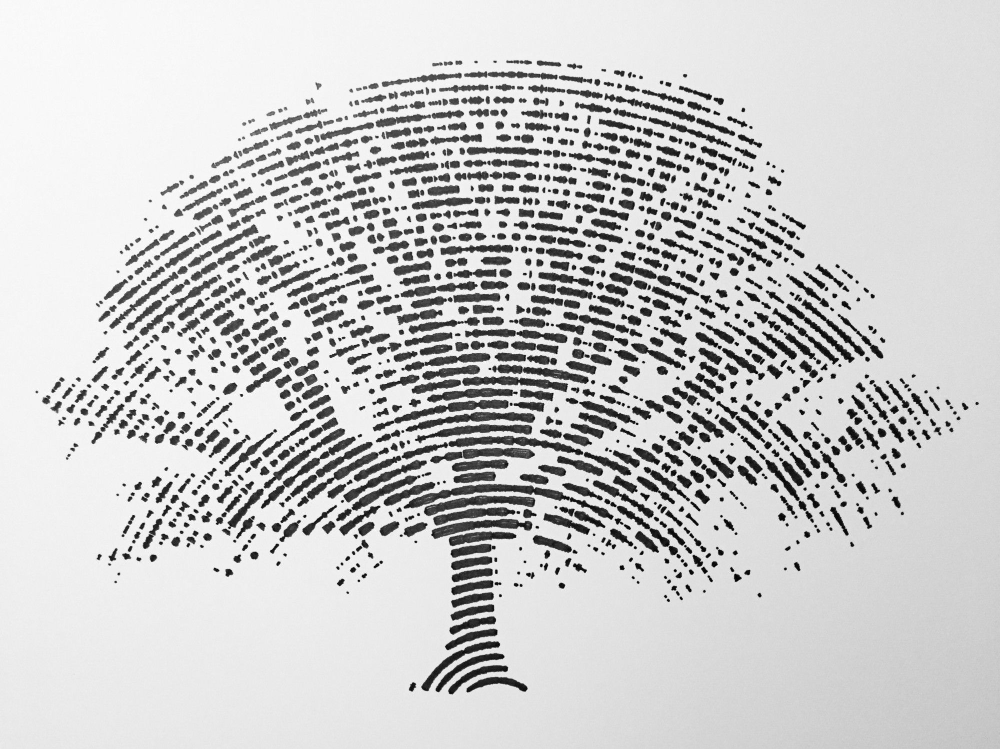

# Preperation

Programming is a form of art

[[ref]](https://sites.google.com/site/computers4creativity/about/programming-art-math)

## Programming Introductin

### What is a computer?

> A computer is a programmable device that stores, retrieves, and processes data. The term "computer" was originally given to humans (human computers) who performed numerical calculations using mechanical calculators, such as the abacus and slide rule. The term was later given to mechanical devices as they began replacing human computers. Today's computers are electronic devices that accept data (input), process that data, produce output, and store (storage) the results (IPOS).

[[ref]](https://www.google.com/search?q=programming&oq=programming+&aqs=chrome..69i57j69i61l3.3345j0j1&sourceid=chrome&ie=UTF-8)

### What is programming?

* "Programming is like building a world from atoms"

## Atoms?

* 
* If else 
