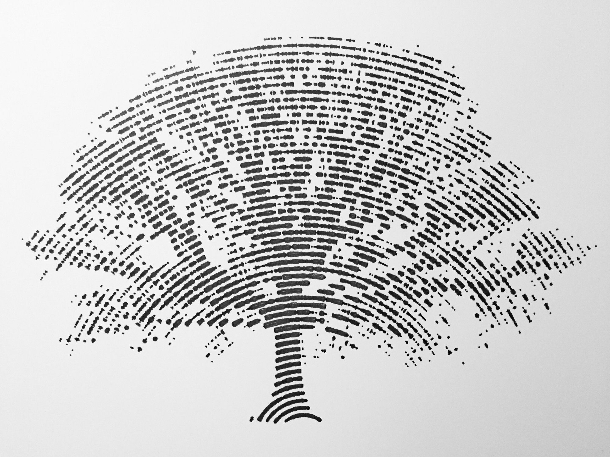

# Class 1. Introduction to Programming

## About me 潘奕平

* 現仼 Synopsys 軟體工程師 (編譯器工程師)
* Risc-V emulate (rv32emu) 開源貢獻者
  
* 2022 台積電 CareerHack 比賽第二名
* 2022 Inter DevCup 進入決賽 (進入中)

## Programming

## Programming Introduction

### What is a computer?

* 電腦 (中國: 計算機)

* Definition

  > A computer is a programmable device that stores, retrieves, and processes data. The term "computer" was originally given to humans (human computers) who performed numerical calculations using mechanical calculators, such as the abacus and slide rule. The term was later given to mechanical devices as they began replacing human computers. Today's computers are electronic devices that accept data (input), process that data, produce output, and store (storage) the results (IPOS).

  [[ref]](https://www.google.com/search?q=programming&oq=programming+&aqs=chrome..69i57j69i61l3.3345j0j1&sourceid=chrome&ie=UTF-8)

* 人很貴！
  如何減少人力的使用，快速的完成本來要做的事。
* 推薦電影: Alan Turing: The Enigma <模仿遊戲>
  * 電腦發明者的故事
* Before Computer\
  
  [[ref]](https://medium.com/@mashinyire/letter-to-my-nephew-69674cbf4d98)

### What is a program?

  ```mermaid
  graph TD
    A[Human] -->|Input| B[Computer]
    B--> |Output| C[Human/Computer]
  ```

* 能在**電腦**上執行**特定任務**的一連串的機器**指令**

### What is programming?

Programming is a form of art\


[[ref]](https://sites.google.com/site/computers4creativity/about/programming-art-math)

* "Programming is like building a world from atoms"
* 程式 = 資料 + 運算邏輯

## 資料 Hands on

### Environment

* What is python
* Open vscode
* Terminal
* Run python3 in raw

### Excercise 1 - Hello World

* Know develop flow
* Goal know print
* Start to read debugging message

```python3
print("Hello world")
```

### Excercise 2 - Type and Identifier

* Operand `=` usage
* Identifier is a drawer

```python3

a = 0;
b = 1.0
c = "Hello"

print("Value:", a, b, c)
print("Type: ", type(a), type(b), type(c))
```

### Excercise 3 - Simple Calculator

* `type()`
* Data + Operand

### Excercise 4 - Try it yourself
