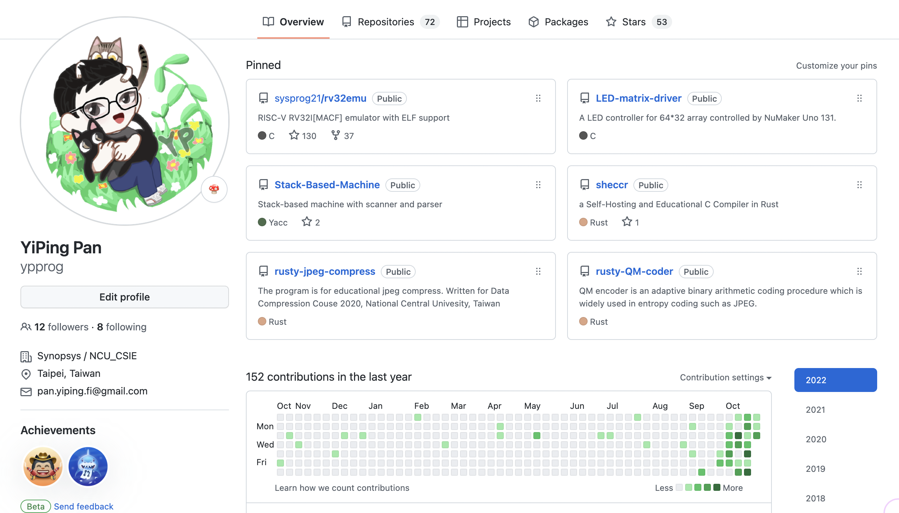

# Class 1. Introduction to Programming

## About me 潘奕平

* 現仼 Synopsys 軟體工程師 (編譯器工程師)
* Risc-V emulate (rv32emu) 開源貢獻者
  
* 2022 台積電 CareerHack 比賽第二名
* 2022 Inter DevCup 進入決賽 (比賽中)

## Programming

## Programming Introduction

### What is a computer?

* 電腦 (中國: 計算機)

* Definition

  > A computer is a programmable device that stores, retrieves, and processes data. The term "computer" was originally given to humans (human computers) who performed numerical calculations using mechanical calculators, such as the abacus and slide rule. The term was later given to mechanical devices as they began replacing human computers. Today's computers are electronic devices that accept data (input), process that data, produce output, and store (storage) the results (IPOS).

  [[ref]](https://www.google.com/search?q=programming&oq=programming+&aqs=chrome..69i57j69i61l3.3345j0j1&sourceid=chrome&ie=UTF-8)

* 人很貴！
  如何減少人力的使用，快速的完成本來要做的事。
* 推薦電影: Alan Turing: The Enigma <模仿遊戲>
  * 電腦發明者的故事
* Before Computer

  

  [[ref]](https://medium.com/@mashinyire/letter-to-my-nephew-69674cbf4d98)

### What is a program?

  ```mermaid
  graph TD
    A[Human] -->|Input| B[Computer]
    B--> |Output| C[Human/Computer]
  ```

* 能在**電腦**上執行**特定任務**的一連串的機器**指令**

### What is programming?

Programming is a form of art


[[ref]](https://sites.google.com/site/computers4creativity/about/programming-art-math)

* "Programming is like building a world from atoms"
* 程式 = 資料 + 運算邏輯

## 資料 Hands on - 動手做

### Environment

* What is python
* Open vscode
* Terminal
* Run python3 in raw

### Excercise 1 - Hello World

* Know develop flow
* Goal know print
* Start to read debugging message
* Learn how to output
  * [prinfYour Guide to the Python print() Function](https://realpython.com/python-print/)

```python3
# This is a comment, will not execute
print("Hello world")
print('Hello world')
```

Sequential execution

```python3
print("Hello world")
print("Lets")
print("create a world")
print("by code.")
```

What is a identifier?

```python3
name = "ypprog"

print("Hello", name)
print("Lets")
print("create a world")
print("by code.")
```

### Excercise 2 - Type and Identifier - 資料

* Operand `=` usage
* Identifier is like a drawer

```python3
a = 1
b = 1.0
c = "Hello"
d = true

print("Value:", a, b, c, d)
print("Type: ", type(a), type(b), type(c), true(d))
```

* Python data type
  * [Python 初學第二講 — 資料型態與轉換](https://medium.com/ccclub/ccclub-python-for-beginners-tutorial-d26900b9280e)

Same as

```python3
a:int = 1
b:float = 1.0
c:str = "Hello"
d:bool = true

print("Value:", a, b, c, d)
print("Type: ", type(a), type(b), type(c), type(d))
```

### Excercise 3 - Simple Calculator

* `type()`
* Data + Operand

#### Operator

* Unary operator
  * 取正號 `+`
  * 取負好 `-`
* Binary operator
  * `+`, `-`, `*`
  * 浮點數除法 `/`
  * 整數除法 `//`
  * 取餘數 `%`
* [認識運算子](https://www.dotblogs.com.tw/YiruAtStudio/2020/12/30/192744)

```python3
a = 1
b = 2
c = a + b
d = a - b

print("c is", c, "and d is", d)
print("c is {} and d is {}".format(c, d))
```

Take user input

```python3
print("Whats your name?")
name = input()
# name = input("What is your name?")

print("Hi {}, good day isn't it?".format(name))
```

* **intput type will be str, check with `type()`**
* how to transfer to interger? `int()`

Adder

```python3
a = input("Input a number: ")
b = input("Input another number: ")
c = int(a) + int(b)
print("The sum is {}".format(c))
```

### Excercise 4 - Odd or Even - If statement

### Excercise 5 - Count to 10

For loop - range(start, stop [,step])

```python3
for i in range(1,10):
    print("i is: {}".format(i))
```

Count to 10

* How to debug? Print information

```python3
count = 0

for i in range(1,10):
    count = count + i

print("Sum is: {}".format(count))
```
